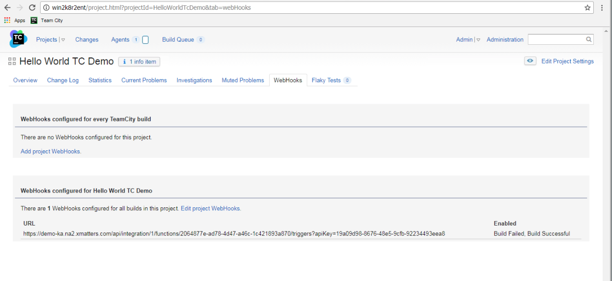
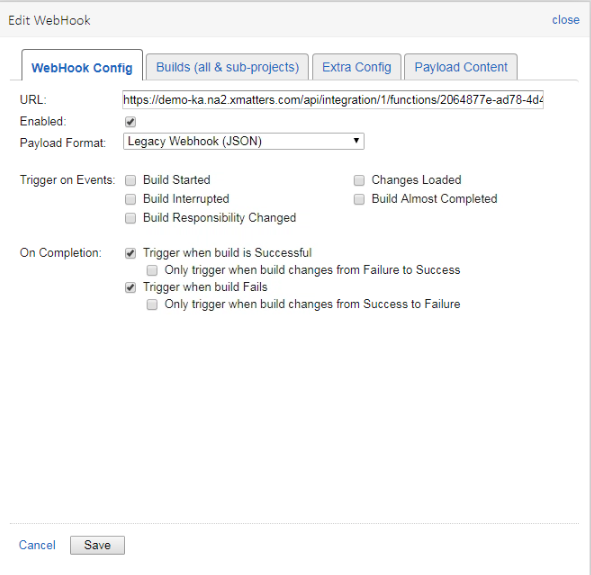
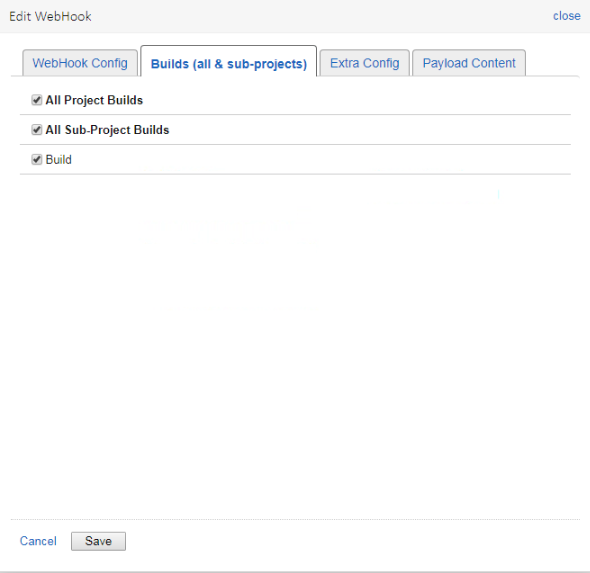
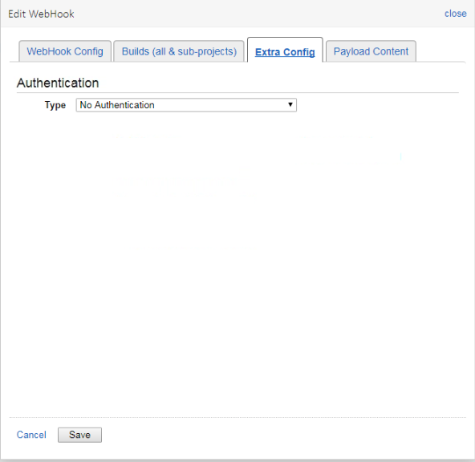
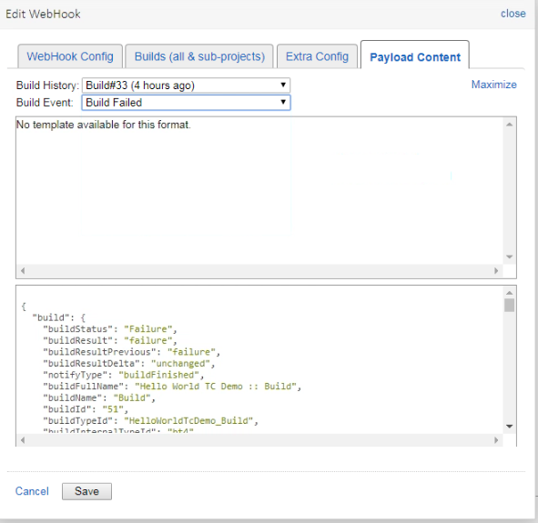
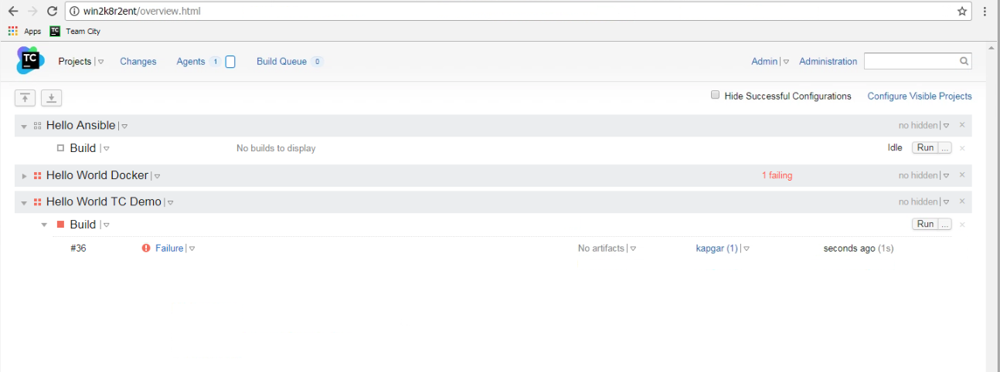
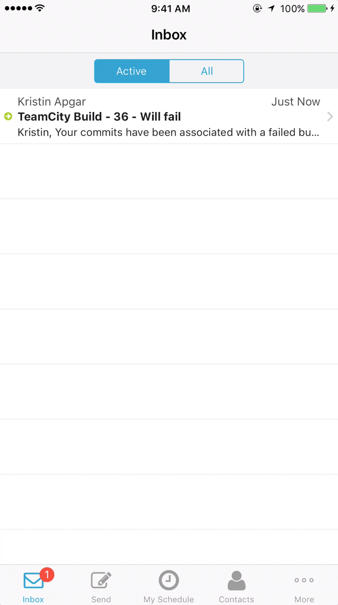
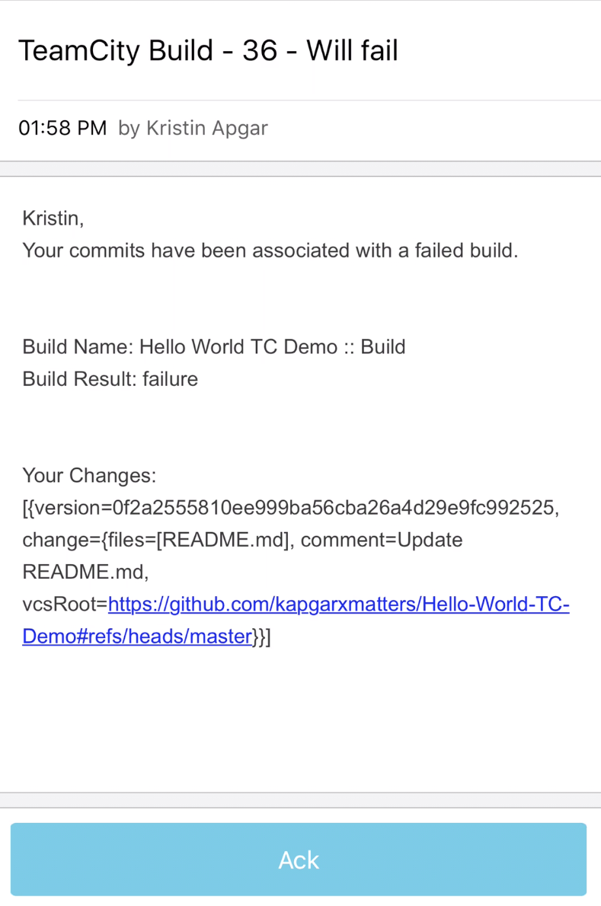

# TeamCity
TeamCity is a Java-based build management and continuous integration server from JetBrains. 

# Pre-Requisites
* TeamCity Instance with the webhook plugin installed.
* xMatters account - If you don't have one, [get one](https://www.xmatters.com)!

# Files
* [teamcityUtility.js](teamcityUtility.js) - The javascript file to be pasted into a Shared Library. TeamCity pushes the general changes of a build.  This library reaches back into Teamcity to get the changes for each individual who committed on this build.   
* [TeamCity.zip](TeamCity.zip) - The Communication Plan (optional).  You can use this pre built communication plan and import it into your xMatters instance or create one from scratch. 
* [Inbound_Build.js](Inbound_Build.js) - The javascript file to be pasted into the Inbound IB component.  This script calls the library.

# Installation

## TeamCity set up
Install the TeamCity webhook plugin [TeamCity Webhooks](https://plugins.jetbrains.com/plugin/8948-webhooks).  In TeamCity select a project and click on the Webhook Tab.  In the Webhook tab add a new webhook.
<kbd>

</kbd>


Enter the information needed to point to xMatters in the build steps.
<kbd>

</kbd>
<kbd>

</kbd>
<kbd>

</kbd>
<kbd>

</kbd>

See the below list for the required information:

| Input | Value |
| ----- | ------|
| URL   | This in an xMatters Inbound Integration URL.  You will create this on step 3 in the xMatters set up section.  For additonal information see instructions on how to create. [Inbound Integration](https://help.xmatters.com/OnDemand/xmodwelcome/integrationbuilder/build-integrations.htm) |
| Enabled | checked |
| Payload Format | Legacy Webhook (JSON) |
| Trigger on Events | none checked |
| On Completion | see screen shot |
| All Project Builds | checked |
| All Sub-Project Builds | checked |
| Build | checked |
|Authentication Type | No Authentication |
| Payload Content | Nothing needs to be changed we use the default settings |

The following is an example of what is sent when a build fails:

```
{
"build":{
"buildStatus":"Failure",
"buildResult":"failure",
"buildResultPrevious":"failure",
"buildResultDelta":"unchanged",
"notifyType":"buildFinished",
"buildFullName":"Hello World TC Demo :: Build",
"buildName":"Build",
"buildId":"51",
"buildTypeId":"HelloWorldTcDemo_Build",
"buildInternalTypeId":"bt4",
"buildExternalTypeId":"HelloWorldTcDemo_Build",
"buildStatusUrl":"http://win2k8r2ent/viewLog.html?buildTypeId=HelloWorldTcDemo_Build&buildId=51",
"buildStatusHtml":"<span class=\"tcWebHooksMessage\"><a href=\"http://win2k8r2ent/project.html?projectId=HelloWorldTcDemo\">Hello World TC Demo</a> :: <a href=\"http://win2k8r2ent/viewType.html?buildTypeId=HelloWorldTcDemo_Build\">Build</a> # <a href=\"http://win2k8r2ent/viewLog.html?buildTypeId=HelloWorldTcDemo_Build&buildId=51\"><strong>33</strong></a> has <strong>finished</strong> with a status of <a href=\"http://win2k8r2ent/viewLog.html?buildTypeId=HelloWorldTcDemo_Build&buildId=51\"> <strong>failure</strong></a> and was triggered by <strong>Git</strong></span>",
"buildStartTime":"",
"currentTime":"",
"rootUrl":"http://win2k8r2ent",
"projectName":"Hello World TC Demo",
"projectId":"HelloWorldTcDemo",
"projectInternalId":"project4",
"projectExternalId":"HelloWorldTcDemo",
"buildNumber":"33",
"agentName":"win2k8r2ent",
"agentOs":"Windows Server 2008 R2, version 6.1",
"agentHostname":"127.0.0.1",
"triggeredBy":"Git",
"message":"Build Hello World TC Demo :: Build has finished. This is build number 33, has a status of \"failure\" and was triggered by Git",
"text":"Hello World TC Demo :: Build has finished. Status: failure",
"buildStateDescription":"finished",
"buildRunners":[
"Container Deployer"
],
"buildTags":[
],
"extraParameters":[
{
"name":"preferredDateFormat",
"value":""
}
],
"teamcityProperties":[],
"changes":[
{
"version":"a9026bb7810183ad0b42855b40c7f8d439b9cd52",
"change":{
"files":[
"server.js"
],
"comment":"Update server.js",
"vcsRoot":"https://github.com/kapgarxmatters/Hello-World-TC-Demo#refs/heads/master"
}
},
{
"version":"fe04dbe00f1ed84b9f5b385fab3ef8ee51fa8982",
"change":{
"files":[
"README.md"
],
"comment":"Update README.md",
"vcsRoot":"https://github.com/kapgarxmatters/Hello-World-TC-Demo#refs/heads/master"
}
}
]
}
}
```


## xMatters set up
1. Import the Communication Plan [TeamCity.zip](TeamCity.zip).  If this step is done you can skip steps 2-4.
2. Optional - Create a new Shared Library and add the code from the teamcityUtility.js file.  
3. Optional - Create Inbound integration and add the code from the Inbound_Build.js file.
4. Optional - Create a Build Form.
5. Configure a TeamCity Endpoint. [xMatters Endpoints]https://help.xmatters.com/OnDemand/xmodwelcome/integrationbuilder/configure-endpoints.htm
6. Create a users in xMatters that match userids in TeamCity. [xMatters Users](https://help.xmatters.com/OnDemand/groups/users.htm).  
   
# Testing
Have more then one person commit changes.  Run a Build in TeamCity.  You should see in the project console, when the build fails the webhook will push the build information to xMatters.  xMatters querries TeamCity for each change and notifies the committer of the change with their specifi changes and the build failure description.
<kbd>

</kbd>

A message should come through on your devices with your specific changes.  Which ever devices you have configured in xMatters.
<kbd>

</kbd>
A message should come through on your devices with your specific changes.  Which ever devices you have configured in xMatters.
<kbd>

</kbd>

# Troubleshooting
View xMatters Activity Stream to determine issues with Jenkins connectivity.
